# snapp-hack

Unofficial notes on **SnappFood** and **SnappMarket** (Snapp Express): how the two products are split, how vendor lists are really scoped, and how the many named “discounts” compose on a bill.

This is **not** an official dump, SDK, or affiliate project. Field names and numbers were inferred from public client traffic and UI copy in September 2026. They drift. Treat every table as a hypothesis.

No accounts, tokens, addresses, or session data are included.

---

## Contents

1. [Two products, two stacks](#1-two-products-two-stacks)
2. [Identity and money](#2-identity-and-money)
3. [Catalogs](#3-catalogs)
4. [Vendor lists are pin-scoped](#4-vendor-lists-are-pin-scoped)
5. [Discounts: four ledgers, one coupon](#5-discounts-four-ledgers-one-coupon)
6. [Named offers](#6-named-offers)
7. [Market Party](#7-market-party)
8. [Cart, checkout, orders](#8-cart-checkout-orders)
9. [Cross-walk](#9-cross-walk)
10. [What this is not](#10-what-this-is-not)

---

## 1. Two products, two stacks

Opening “Food” or “Market” from SuperApp does **not** land on one backend. Food is a Next.js PWA on `snappfood.ir` / `apigw.snappfood.ir`. Market is a separate Webpack PWA on `snapp.market` / `svc.snapp.market` (also branded Snapp Express).

Food grocery tiles (fruit, protein, produce) stay on the **Food** vendor-list API. The Food home tile “سوپرمارکت” deep-links out to Express.

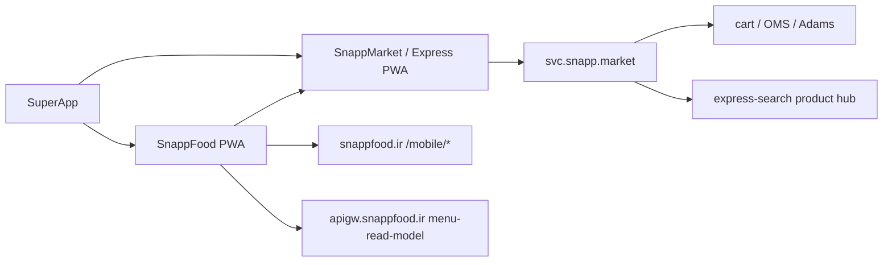

| | SnappFood | SnappMarket / Express |
|---|---|---|
| Sites | `snappfood.ir`, `superapp.snappfood.ir` | `snapp.market`, `snapp.express` |
| Frontend | Next.js PWA | Webpack PWA (`static.snapp.express`) |
| API core | `/mobile/v1–v5`, `apigw.snappfood.ir` | `svc.snapp.market` gateway |
| Auth | Heimdall JWT | Separate Express JWT + Adams user |
| Catalog | Per-vendor menus | Shared product hub + per-vendor stock |
| Public vendor id | 6-char `vendorCode` | 6-char `code` |
| Numeric vendor id | own sequence | own sequence (not the Food one) |
| Cart | client-side persist keyed by vendor | server UUID cart, multi-basket |
| CDN | `cdn.snappfood.ir` | `cdn.snapp.express` |

---

## 2. Identity and money

The same Snapp login produces **two user rows**. Address books are not shared. Coverage uses lat/lng, not `city_id` (that field can be wrong).

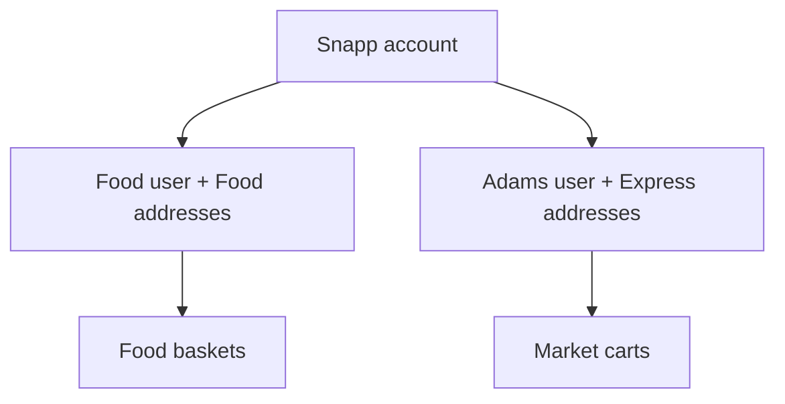

Money on both stacks is an **integer** in the unit the UI labels تومان. Service fee, delivery, and goods are separate lines.

Cities are a real table: `GET /mobile/v2/area/cities` returned about **300** rows (Tehran `id=1`, then Mashhad, Karaj, Esfahan, Shiraz, …). A city is a default pin, not a catalog.

---

## 3. Catalogs

### Food: vendor-owned menu

A kitchen owns its SKUs (`product_variations`). List cards are a wide denormalized DTO. Detail is `menu-read-model`.

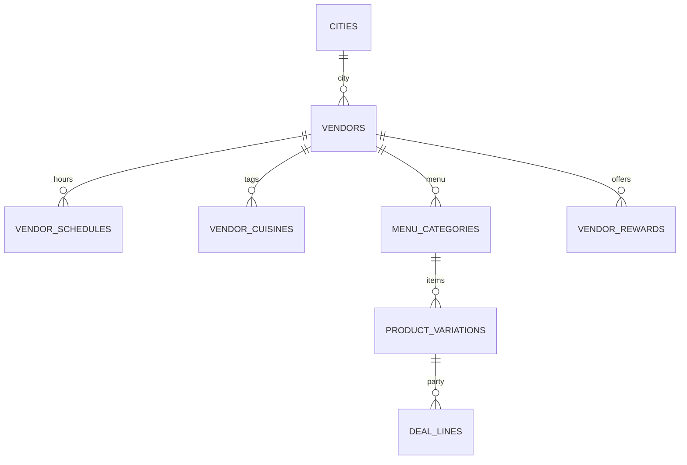

**Food `super_types`** (home tiles / `page_supertype`):

| id | alias | UI |
|---|---|---|
| 1 | `RESTAURANT` | رستوران |
| 2 | `CAFFE` | کافه |
| 3 | `CONFECTIONERY` | شیرینی |
| 5 | `BAKERY` | نانوایی |
| 6 | `GROCERY` | میوه |
| 8 | `JUICE` | آبمیوه بستنی |
| 11 | `PROTEIN` | پروتئین |
| 28 | `PRODUCE_MARKET` | تره‌بار |

Other ids (pharmacy, pet, nuts, gift, …) appear on off-box filters. `superTypeAlias` / `vendorType` / `childType` are the same family. A restaurant can also have `sub_type` (e.g. fast food).

Vendor badge types seen: `FoodParty`, `hasCoupon`, `hasCashBack`, `hasDiscount`, `isPro`, `isEco`. `is_jimbo` is a flag, not a badge.

### Market: hub SKU × vendor offer

One national product, many store offers. Join key looks like `document_id = {product_id}-{vendor_id}`. Image filenames often embed a GTIN.

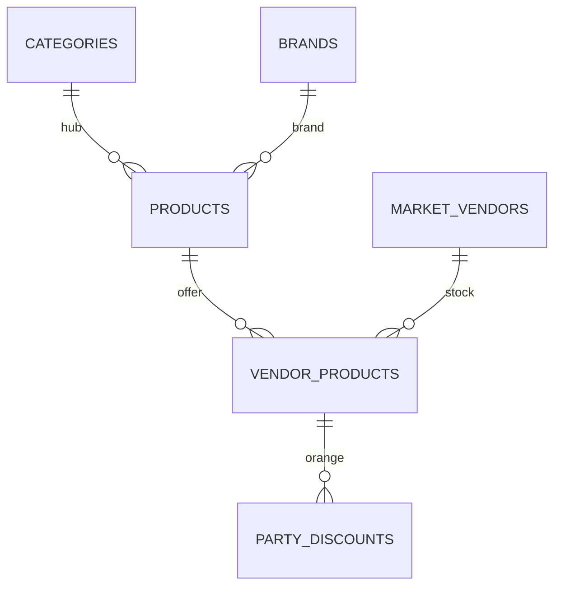

Market vendor `vendor_type`: `DARK_STORE` | `CORNER_SHOP` | `CHAIN_STORE`.

List sections (filters over the **same** nearby set, not extra stores):

| section | UI |
|---|---|
| `all` | همه |
| `non_pro` | فروشگاه‌های پرو |
| `super_mall` | هایپرمارکت |
| `freshness_guarantee` | تضمین تاریخ |
| `turbo` | ارسال توربو |
| `pickup` | مراجعه حضوری |
| `free_delivery` | ارسال رایگان |

Root hub categories (ids are arrays at the root, scalars on children): dairy, snacks, groceries, breakfast, baby, health, produce, spices, canned, protein, drinks, nuts, cleaning, home, digital, smoking, fashion, pet — plus a synthetic کالابرگ root.

---

## 4. Vendor lists are pin-scoped

There is **no** nationwide “all restaurants / all bakeries / all markets” endpoint. `lat`/`long` missing → Food list returns `400 lat long not valid`. `city_id` on the list call was ignored. `/sitemap.xml` was 404.

The list copy is «فروشگاه‌های اطراف شما»: who can serve **this pin**.

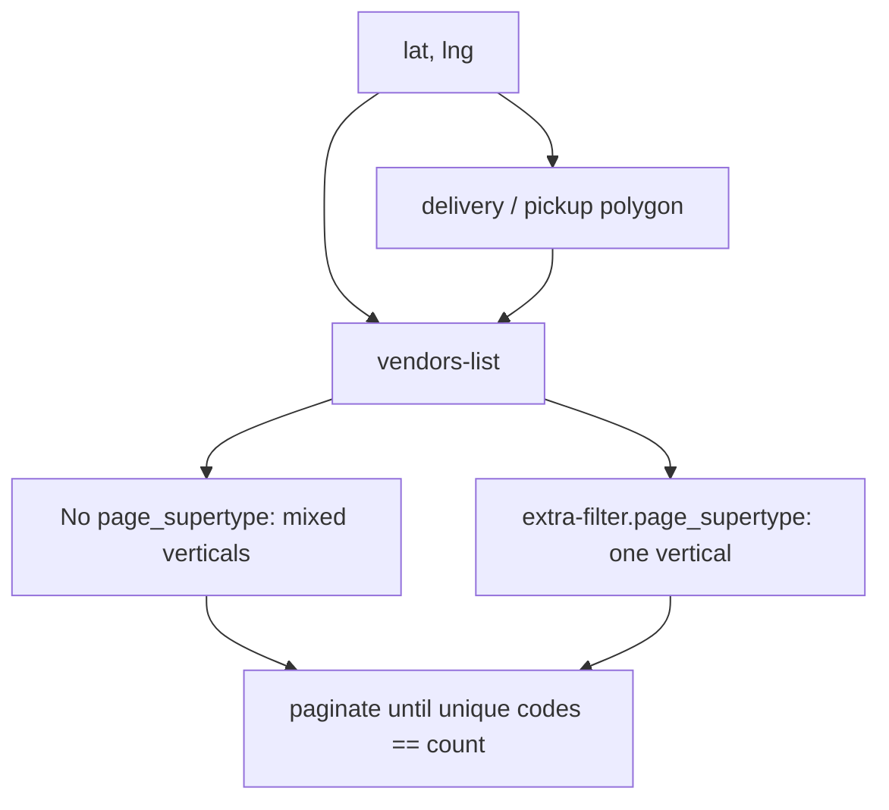

`superType=` alone did **not** filter. The working switch is `extra-filter.page_supertype`.

Sample at a **central Tehran** pin (September 2026):

| call | count | open |
|---|---|---|
| Food list, no `page_supertype` | ~930 | ~895 |
| same pin, `page_supertype=[1]` restaurants | ~582 | ~561 |
| same pin, `page_supertype=[2]` | ~137 | ~133 |
| another Tehran neighborhood, mixed | ~669 | ~632 |
| Market `vendors-list` at one address | ~17 | ~17 |

Closed kitchens stay on the Food list (`count` > `open_count`). Inactive or out-of-polygon vendors never appear.

Market’s query `latitude`/`longitude` can be ignored if the PWA has already bound an active address. Sections like turbo / pickup are subsets of those ~17 stores.

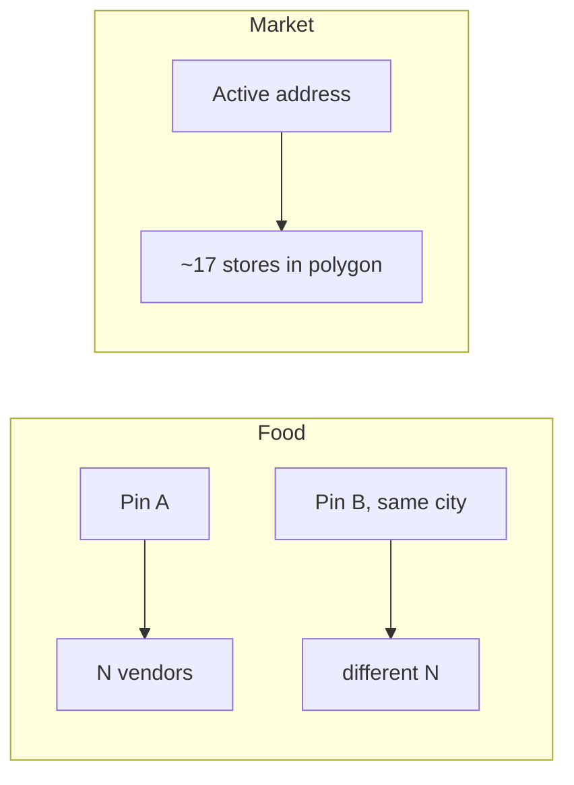

**Implication:** a city center is not the city. Two pins a few kilometers apart return different censuses.

---

## 5. Discounts: four ledgers, one coupon

The UI names (تخفیف داغ, فودپارتی, شکار, فودپرو, کالاهای هدیه, نارنجی, …) are **not** one engine. Food prices are four ledgers that add. They do not merge into a single percent.

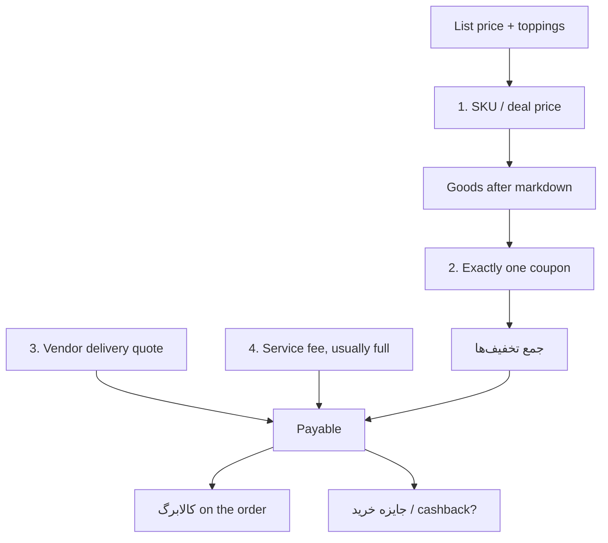

| # | ledger | where it lives | coupon slot? |
|---|---|---|---|
| 1 | SKU / deal price | line `discount {amount, ratio}`; party id suffix `-special` | no |
| 2 | **One coupon** | `vendor-rewards` `type=coupon` | **yes — pick one** |
| 3 | Delivery quote | `deliveryFee` → `deliveryFeeAfterDiscount` | no |
| 4 | Service fee | own line | almost never |
| after | کالابرگ | order `kalabarg_adjustment_amount` | no |
| after | جایزه خرید | rewards `type=cashback` | unconfirmed vs coupon |

Sheet copy: «در هر سفارش امکان انتخاب یک کوپن وجود دارد».

Auto-pick is `is_auto_selected` + `is_earned`. `is_best_offer` is only ranking («بهترین پیشنهاد»). An earned Gem coupon beats a Pro coupon that is not yet earned (min basket).

`GET …/menu-read-model/vendor-rewards/{code}` row types:

| type | payload | coupon slot? |
|---|---|---|
| `coupon` | `coupon_data` | yes |
| `foodparty` | `{ title, discount }` | no — SKU ledger |
| `discount` | `{ amount }` | no — menu % cap |
| `cashback` | `{ is_active }` | no |

FoodPro membership is **not** a fifth engine. It *issues* a coupon (`type=PRO`).

### Sample bill (party SKU + Pro on the remainder)

Party markdown first, then the single coupon on leftover goods. Delivery and service sit outside `جمع تخفیف‌ها`.

| line | toman |
|---|---|
| list | 525,000 |
| party 50% on the item | −262,500 |
| Pro 5% of the **remaining** 262,500 | −13,125 |
| goods discounts | 275,625 |
| delivery 68,000 → 23,000 (vendor quote, not the coupon) | +23,000 |
| service | +7,500 |
| payable | 279,875 |

Toppings on a party line stay full price. Vendor `minOrder` still applies — a cheap party SKU does not always clear it.

---

## 6. Named offers

### تخفیف داغ is a directory

`/off-box/` is an aggregator, not a discount type. Hero rails: menu %, cashback, free delivery, free extra item, Food Party, FoodPro. The default API is a **vendor** list with one `promotion_text`. The Party **tab** is a different feed: SKU cards from food-party.

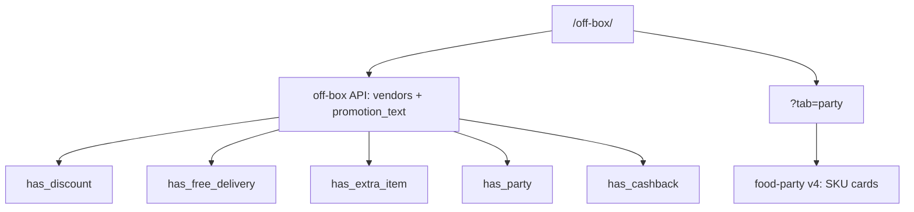

| filter | meaning | sample `promotion_text` |
|---|---|---|
| `all` | mix | تا ۲۶٪ تخفیف منو |
| `has_discount` | menu % | تا ۲۶٪ تخفیف منو |
| `has_free_delivery` | free delivery coupon or quote | ارسال رایگان با N تومان خرید |
| `has_party` | vendor rollup of party | ۲۵٪ تخفیف پارتی |
| `has_extra_item` | free SKU coupon | محصول رایگان برای خرید اول |
| `has_cashback` | جایزه خرید | often sparse |

### فودپارتی — timed SKU engine

`deal_projects` + daily stock. Same *shape* as Market نارنجی. Feed title «پارتی با تخفیف داغ». On a vendor menu the rail can be **renamed** (e.g. «تخفیف غذای سالم و رژیمی», «تخفیف روز») and still be `type=foodparty`.

| field | role |
|---|---|
| `deal_project_list_id` | day’s list (e.g. 61) |
| `deal_project_id` / code | campaign row |
| `vendor_daily_deal_id` | per-kitchen day |
| `stock_schedule_*` | window (sample ~11:00–17:00) |
| `discountRatio` / `priceAfterDiscount` | baked into the line |
| `remaining` / `total_stock` | stock |
| `capacityPerOrder` | usually 1 |
| `proDiscountRatio` | eligible % on the feed |
| `hasProDiscount` | **false on the feed** — Pro is the later coupon |

Basket line id becomes `{variationId}-special`.

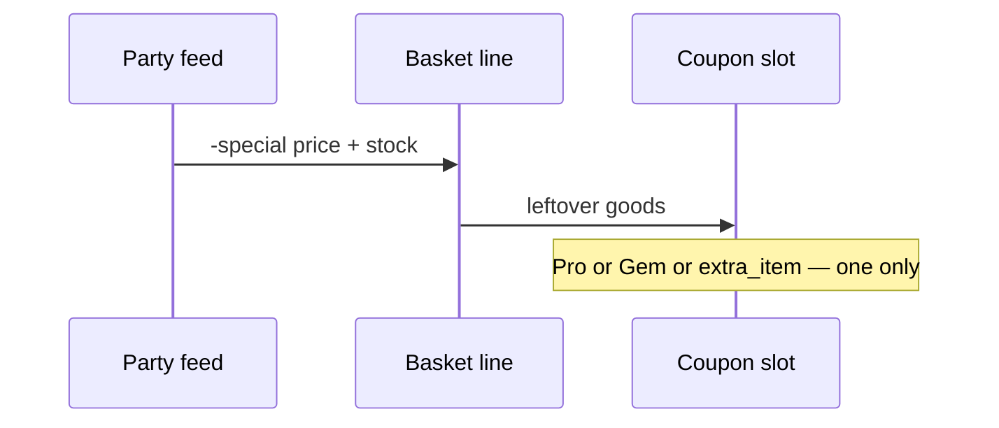

### تخفیف منو

Vendor-level cap baked into ordinary SKU prices. Rewards row `type=discount`. Not a coupon. A kitchen can expose **both** menu % and a party rail.

### شکار / Gem

Flash **coupon**, vendor-scoped, minute-level window. Condition `days_passed_from_last_order_of_vendor`. Reward `total_discount`, typically 10–25% with a 500k cap. SKU stays `-normal`. **Replaces** Pro; both are coupons.

### فودپرو

Plan 71. Landing is home v7 + a VIP vendor collection (`filters=is_vip`). Marketing copy (“20% + free delivery”) is not the per-vendor coupon. Observed coupons: 5% basket, or 0% basket titled ارسال رایگان. Condition is usually `basket_price` (min often 200k).

Market Pro is a **delivery-fee package**, not a percent off goods (coupon 2522, min basket on the order of 280k).

### Coupons: types, rewards, conditions

`reward`: `total_discount` | `extra_item` | `free_delivery_fee`.

| `type` | reward | typical shape |
|---|---|---|
| `PRO` | `total_discount` | 0–5% and/or free-delivery title |
| `GEM` | `total_discount` | 10–25%, cap ~500k |
| `CAMPAIGN` | `free_delivery_fee` | 100% delivery, `maxDiscount=-1`, high min basket |
| (null) | `extra_item` | `extraProducts[{ productVariationId, price: 0 }]` |
| (null) | `total_discount` | generic % at a high min |

| `condition` | meaning |
|---|---|
| `basket_price` | min goods |
| `days_passed_from_last_order_of_vendor` | Gem flash |
| `orders_of_vendor_count` | nth order here (`activation_order_number=1` = first order) |
| `product_variation` | must add SKU X (buy A, get free B) |

`extra_item` still **is** the coupon. Picking free wings drops Pro/Gem.

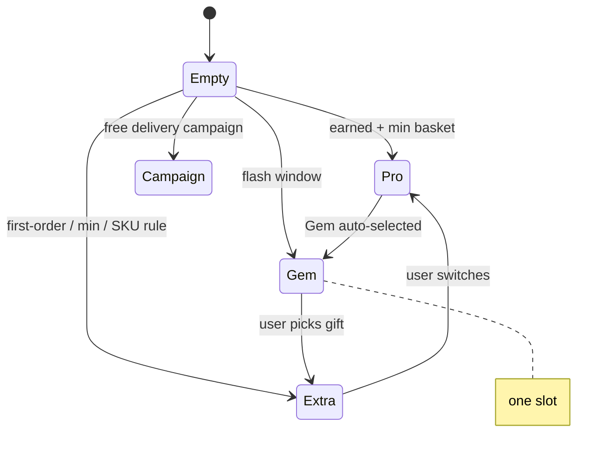

### سفارش یک‌نفره / اکو

`/meal-for-one/` is a curated SKU list (price cap on the order of 299k + free delivery on the quote), **not** a coupon. `isEco` is a vendor badge; «اکوپلاس» is a product line. Jimbo is a vendor flag.

### کالابرگ

Payment subsidy, not a coupon. Market badge id 114, type `BEST_PRICE`. Can sit **on** a Party SKU.

---

## 7. Market Party

تخفیف نارنجی: stock-capped hub markdown. **Does not** take the coupon slot — Pro free-delivery can still apply.

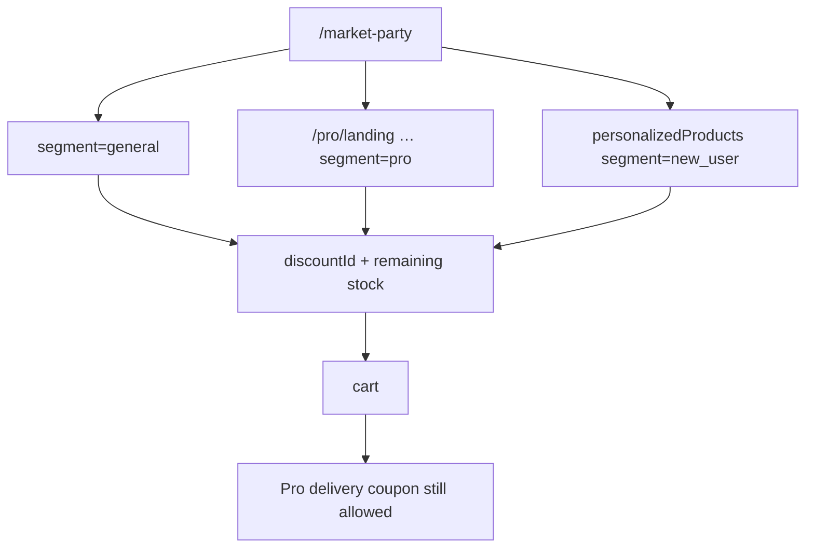

| | Food Party | Market Party |
|---|---|---|
| UI | `/off-box/?tab=party` | `/marketparty-list` |
| Object | menu variation `-special` | hub offer + `discountId` |
| Window sampled | ~11:00–17:00 | ~24 hours |
| Cap | usually 1 SKU / order | campaign `capacityPerOrder` 2; per-SKU 1–2 |
| Segments | `forNewUsers` unused here | `general` / `pro` / `new_user` |
| Coupon slot | no | no |
| New-user rail | — | 95–99% samples on `personalizedProducts` |

`totalStock` looks like a campaign pool; `stock` is remaining at that store.

---

## 8. Cart, checkout, orders

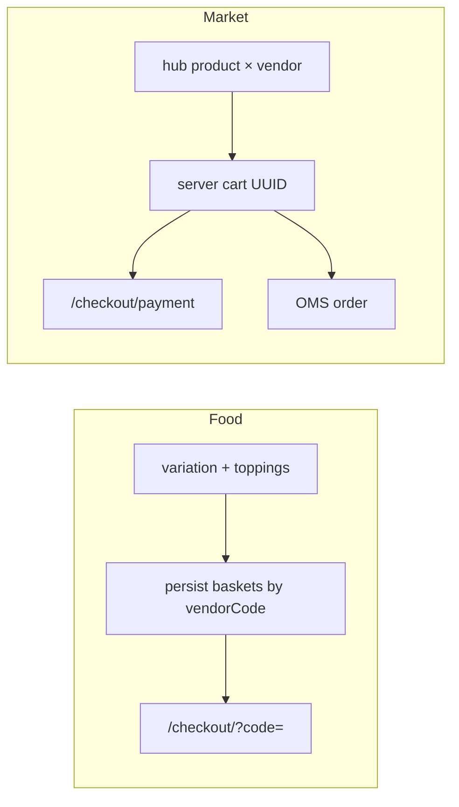

| | Food | Market |
|---|---|---|
| Cart | client `baskets[vendorCode]` | `GET /cart/v1`, one UUID per vendor |
| Checkout | `/checkout/?code={vendorCode}` | `/checkout/payment` |
| Orders | `/mobile/v3/order/getOrderDetailData` | `/oms/v1/user/orders/{code}` |
| Vouchers | Food coupons on rewards | Belladonna + cart `coupons[]` |

Market shipping radios seen: express / turbo / timeslot / pickup. Banks live on the cart payload. Do not treat refresh-queue error codes (3003/3004/…) as “empty cart”.

Food order states observed in UI: accepted → prepared → on the way → delivered, then review.

---

## 9. Cross-walk

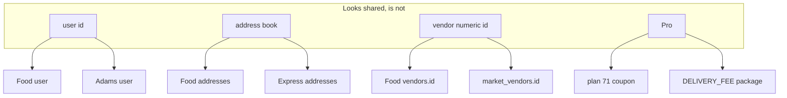

| concept | Food | Market |
|---|---|---|
| Public vendor id | 6-char `vendorCode` | 6-char `code` |
| SKU | `product_variations.id` | `products.id` + `document_id` |
| Menu category | per vendor | global hub |
| Party | `deal_projects` + `-special` | stock markdown + `discountId` |
| Flash coupon | Gem | none seen |
| Extra SKU | coupon `extra_item` | none seen |
| Meal-for-one | curated list | none seen |
| Aggregator UI | `/off-box/` | `/marketparty-list` |
| Delivery | quote on vendor state | `deliveryTypes` + fee |
| Kalabarg | order adjustment | badge 114 |

---

## 10. What this is not

- Not affiliated with Snapp, SnappFood, or SnappMarket.
- Not a client, scraper, or exploit kit. Endpoint paths above are the ones the **official PWAs** already call.
- Not complete: checkout **submit** bodies were not captured; topping groups were empty on sampled pizzas; cashback vs coupon at payment is unconfirmed.
- Numbers (counts, percents, windows, plan ids) are snapshots from September 2026 and will rot.

If you work at Snapp and want something corrected, open an issue.
