# snapp-hack

Unofficial notes on **SnappFood** and **SnappMarket** (Snapp Express): inferred API contracts, field names, and how named “discounts” actually compose.

This is **not** an official dump, SDK, or affiliate project. Names and numbers come from public client traffic and UI copy in September 2026. They drift. Treat every table as a hypothesis.

No accounts, tokens, addresses, or session data are included.

---

## Contents

1. [Two products, two stacks](#1-two-products-two-stacks)
2. [Identity, cities, money](#2-identity-cities-money)
3. [Food catalog](#3-food-catalog)
4. [Market catalog](#4-market-catalog)
5. [Vendor lists are pin-scoped](#5-vendor-lists-are-pin-scoped)
6. [Discounts: four ledgers, one coupon](#6-discounts-four-ledgers-one-coupon)
7. [Named offers](#7-named-offers)
8. [Market Party](#8-market-party)
9. [Cart, checkout, orders](#9-cart-checkout-orders)
10. [API map](#10-api-map)
11. [Cross-walk](#11-cross-walk)
12. [What this is not](#12-what-this-is-not)

---

## 1. Two products, two stacks

Opening Food or Market from SuperApp does **not** land on one backend.

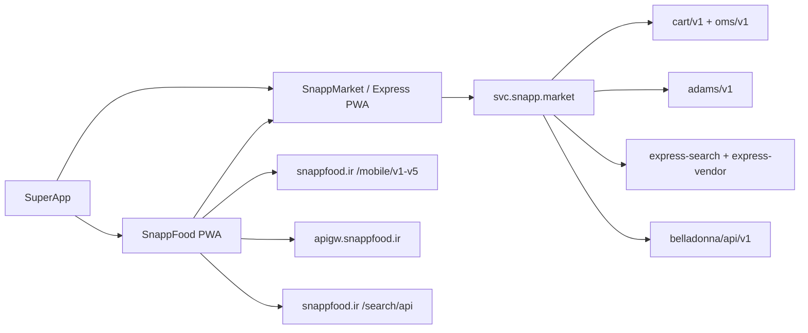

| | SnappFood | SnappMarket / Express |
|---|---|---|
| Sites | `snappfood.ir`, `superapp.snappfood.ir` | `snapp.market`, `snapp.express` |
| Frontend | Next.js PWA | Webpack PWA (`static.snapp.express`, `poweredby: snappGroceryDevops`) |
| API core | `/mobile/v1–v5`, `apigw.snappfood.ir` | `svc.snapp.market/{service}/…` |
| Auth | Heimdall JWT (`iss=user.snappfood.ir`, `aud=snappfood_pwa`) | Express JWT + Adams user |
| JWT scopes seen | `mobile_v1`, `mobile_v2`, `webview` | — |
| Catalog | vendor-owned `menu-read-model` | shared product hub + per-vendor stock |
| Public vendor id | 6-char `vendorCode` | 6-char `code` |
| Numeric vendor id | `vendors.id` | `market_vendors.id` (separate sequence) |
| Cart | client persist `baskets[vendorCode]` | server UUID `/cart/v1` |
| CDN | `cdn.snappfood.ir` | `cdn.snapp.express`, `static.snapp.express` |

Food grocery / protein / produce tiles stay on the **Food** vendor-list API (`superType` 6 / 11 / 28). The Food home tile “سوپرمارکت” deep-links to Express.

Named Market backends behind the gateway:

| prefix | role |
|---|---|
| `express-vendor` | store locator, schedules |
| `express-search` | product hub + vendor catalog |
| `express-home` | home rails |
| `cart/v1` | carts |
| `oms/v1` | orders |
| `adams/v1` | user + addresses + age-check |
| `belladonna/api/v1` | vouchers |
| `payment/v1` | PSP list |
| `user-experience` | favorites, previous purchase |
| `cs/pwa` | banners, support order products |
| `feature-toggles/api` | GrowthBook-style flags |
| `market-party` | نارنجی deals |

---

## 2. Identity, cities, money

The same Snapp login produces **two user rows**. Address books are not shared. Coverage uses `latitude` / `longitude`, not `city_id` (that field can be wrong).

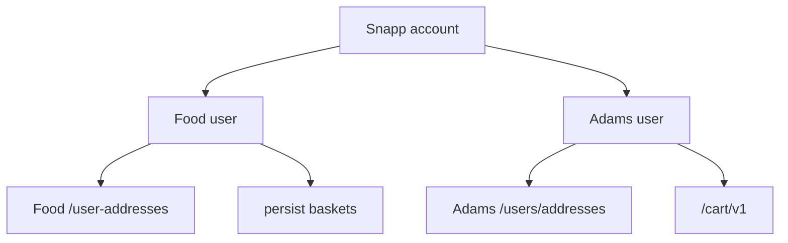

Money on both stacks is an **integer** in the unit the UI labels تومان. Goods, delivery, and service fee are separate lines.

### `cities`

`GET /mobile/v2/area/cities` — about 300 rows.

| field | notes |
|---|---|
| `id` | int PK; `1` = Tehran |
| `code` | Latin slug (`Tehran`, `Mashhad`, …) |
| `title` | FA title |
| `latitude`, `longitude` | city-center pin |
| `rank` | homepage sort |

Food location cache also has `isFavorite`, `isExpress` on the active city.

### Food user / address (inferred)

Food user claims / profile fields seen: `userId`, `username`, `cellphone`, `firstname`, `lastname`, `sub`, membership cookie, Pro plan 71.

`GET /mobile/v4/user/user-addresses?lat&long`

| field | notes |
|---|---|
| `id` | bigint |
| `code` | public short code on orders |
| `city_id` | FK cities |
| `label`, `address`, `address_extra` | plaque / unit |
| `latitude`, `longitude` | coverage |
| `is_company`, `company_discount` | |
| `is_confirmed`, `status`, `status_code` | |
| `score` | picker rank |
| `area`, `area_id` | echoed on some orders |

Writes: `POST /mobile/v4/user/address/create`, `…/edit`. Butler copy: `/mobile/v3/butler/address/list`.

### Adams user / address (inferred)

`GET /adams/v1/users`, `GET /adams/v1/users/addresses`

| field | notes |
|---|---|
| `id` | Adams PK (not the Food `userId`) |
| `user_code` | short public code |
| `source` | e.g. `jek` |
| `ageCheck` | bool |
| address `client` | `SNAPP_MARKET` \| `SUPERAPP_SPLITPAGE` \| `""` |
| address `city_id` / `city.title` | can disagree with lat/lng |
| `label`, `address`, `address_extra` | |

Market picker: `/modals/address`, `/modals/address/add`, `/modals/address/add/cities`. Persist `user.activeAddress` often beats URL `?lat=&lng=`.

`GET /mobile/v5/user/pro-info` (Market):

```
{ active, expressProEligible, subscriptions: [{
    title, packageType: "DELIVERY_FEE",
    deliveryPrice, expiresAt, startedAt, source, selected
}] }
```

---

## 3. Food catalog

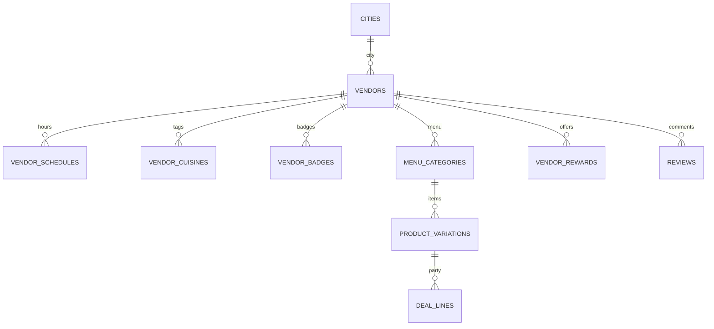

### `super_types`

Used as `page_supertype` / `superTypeAlias` / `vendorType` / `childType`. A vendor also has `vendor_super_type_id` + `vendor_sub_type_id`.

| id | alias | UI |
|---|---|---|
| 1 | `RESTAURANT` | رستوران |
| 2 | `CAFFE` | کافه |
| 3 | `CONFECTIONERY` | شیرینی |
| 5 | `BAKERY` | نانوایی |
| 6 | `GROCERY` | میوه |
| 8 | `JUICE` | آبمیوه بستنی |
| 11 | `PROTEIN` | پروتئین |
| 7 | `NUTS` | آجیل |
| 9 | `OTHERS` | سایر |
| 21 | `PHARMACY` | سلامت و زیبایی |
| 22 | `FLOWER` | گل و گیاه |
| 23 | `PETSHOP` | پت شاپ |
| 24 | `DAIRY` | لبنیات |
| 25 | `ATTARI` | عطاری |
| 26 | `Coffee-and-Chocolate` | قهوه و شکلات |
| 27 | `PROCCESSED_MEAT` | سوسیس کالباس |
| 28 | `PRODUCE_MARKET` | تره‌بار |
| 29 | `ORGANIC` | محصولات طبیعی |
| 30 | `GIFT` | هدیه |

### `vendors` (list DTO)

`GET /mobile/v3/restaurant/vendors-list` returns `{ count, open_count, finalResult[], extra_sections, meta_tags, new_cpc, breadcrumbs, count_details }`.

Rows are `{ type: "VENDOR"|"TEXT", data }`. `TEXT` is the “N فروشنده‌ی باز” header (`super_type_title`: فروشگاه‌های اطراف شما).

| field | notes |
|---|---|
| `id` | int PK |
| `vendorCode` | char(6) |
| `title`, `description` | cuisine string on list |
| `logo`, `defLogo`, `vendor_cover`, `backgroundImage` | urls |
| `chainId`, `chainCode`, `chainTitle`, `chainUrl` | chains; PWA `/service/[service]/chain/[vendorName]` |
| `city`, `city_en`, `city_code`, `address`, `area` | |
| `lat`, `lon` | |
| `status` / detail `status_title` | list `1`; detail `ACTIVE` |
| `establishment` | e.g. `FASTFOOD` |
| `vendorType`, `childType`, `newType` + `*_title` | enum family above |
| `restaurant_class`, `budget_class` | e.g. مناسب |
| `minOrder` | int |
| `taxEnabled`, `taxIncluded`, `taxEnabledInProducts` / `Packaging` / `DeliveryFee`, `tax` | % |
| `serviceFee`, `containerFee` | |
| `discount`, `discount_value`, `discount_value_for_view`, `discount_type`, `discount_for_all` | |
| `discountStartHour1/2`, `discountStopHour1/2` | |
| `paymentTypes` | list `{1,2,5}`; detail `["ONLINE", …]` |
| `onlineOrder`, `noOrder`, `deliver` | |
| `isOpen`, `is_open_now`, `preorder_enabled` | |
| `minDeliveryFee`, `maxDeliveryFee`, `deliveryFee`, `deliveryFeeAfterDiscount` | |
| `isDeliveryFeeHasDiscount` | |
| `deliveryTime`, `eta`, `min_eta`, `max_eta` | minutes |
| `isZFExpress`, `is_express`, `is_pickup` | |
| `is_pro`, `is_eco`, `is_economical`, `is_food_party`, `is_market_party` | |
| `is_ecommerce`, `is_grocery_vip`, `is_vip_packaging` | |
| `is_gem`, `is_jimbo` | |
| `has_coupon`, `coupon_count`, `best_coupon`, `coupon_badge` | |
| `has_first_coupon`, `has_cashback`, `has_kalabarg`, `has_group_order`, `has_packaging` | |
| `has_new_badge` | |
| `calculate_min_order_by_discounted_products` | |
| `rate` (0–5), `rating` / `normalized_rating` (0–10) | |
| `comment_count`, `vote_count`, `count_review`, `count_of_user_images` | |
| `costs_for_two` | |
| `priority`, `trending_score` | |
| `bid`, `cpc_campaign_hash`, `cpc_spot`, `click_id`, `event_hash` | ads |
| `most_popular_items`, `recommended_for`, `menu_url` | |

Detail: `GET apigw…/menu-read-model/vendor-details/{vendorCode}` adds `branch_title`, `scheduleGroups[]`.

### `vendor_schedules`

| field | notes |
|---|---|
| `type` | `0` observed |
| `weekday` | 1–7 |
| `allDay` | bool |
| `startHour`, `stopHour` | `10:00` / `23:58` |

### `vendor_cuisines` (`cuisinesArray`)

| `cuisine_id` | title |
|---|---|
| 1 | ایرانی |
| 4 | پیتزا |
| 7 | فست‌فود (`category=7`) |
| 8 | ساندویچ (`sub=8`) |
| 9 | برگر |
| 11 | فست فود |
| 15 | سوخاری |
| 16 | کباب |
| 36 | سالاد |
| 87 | غذای رژیمی |

### `vendor_badges`

`type`: `FoodParty` | `hasCoupon` | `hasCashBack` | `hasDiscount` | `isPro` | `isEco`

Plus `icon`, `text`, `status=normal`, `is_best_offer`, `can_show`.

### `product_variations`

Search hit type `PRODUCT_VARIATION` (`GET /mobile/v2/product-variation/search`). Menu lives under per-vendor categories (sometimes id `-1`).

| field | notes |
|---|---|
| `id` / `productVariationId` | |
| `productId`, `productTitle` | often null on party feed |
| `title` / `productVariationTitle` | |
| `description` | |
| `price`, `priceAfterDiscount`, `discount`, `discountRatio` | |
| `proDiscountRatio`, `proDiscountAmount`, `hasProDiscount` | |
| `containerPrice`, `vat`, `productVariationVat` | |
| `rating`, `vote_count` | |
| `capacity`, `productCapacity`, `productVariationCapacity` | |
| `images[]` | |
| `popularityBadgeName`, `popularityBadgeURL` | |

Party lines use id suffix `-special` (vs `-normal`). Toppings stay full price.

### Reviews

`GET /mobile/v1/restaurant/vendor-comment?vendorCode`

| field | notes |
|---|---|
| `comment_id` | |
| `vendor_id` | |
| rating / text / created | |
| `user_images` | `imageType=PRODUCT_IMAGE`, `userType=VENDOR\|ZOODFOOD` |

`GET /mobile/v2/restaurant/{code}/favorite` → `{ isFavorite }`.

---

## 4. Market catalog

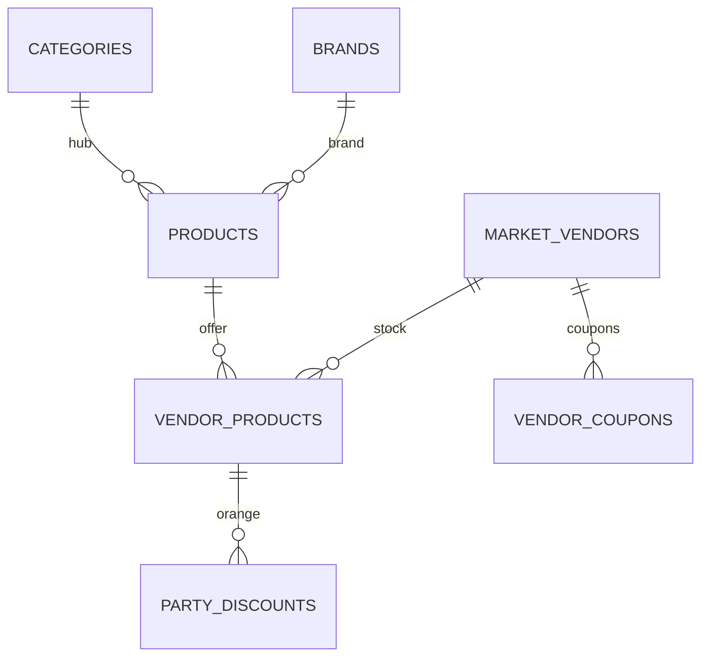

### `market_vendors`

`GET /express-vendor/general/vendors-list?latitude&longitude`

Envelope: `{ count, open_count, finalResult[], sections[], sorts[], single_super_mall }`.

| field | notes |
|---|---|
| `id` | int (72k–118k seen) |
| `code` | char(6) |
| `title`, `area`, `city` | |
| `lat`, `long` | |
| `status` | `ACTIVE` |
| `vendor_type` | `DARK_STORE` \| `CORNER_SHOP` \| `CHAIN_STORE` |
| `logo`, `backgroundImage` | |
| `minimumOrderValue` | |
| `isOpen`, `preOrderEnabled` | |
| `deliveryFee`, `deliveryTime` | |
| `is_express_pin`, `is_pro`, `is_market_party` | |
| `rating` / `rate` | 0–10 |
| `commentCount`, `textCommentCount`, `countReview` | |
| `ads` | `ADS_TYPE_STATIC` \| `ADS_TYPE_PIN` \| `ADS_TYPE_CPC` \| `ADS_TYPE_NONE` |
| `couponDeliveryValue`, `couponMinBasket` | |
| `scheduleOption` | |

`deliveryTypes`: `{ hasExpress, hasVendor, hasSlow, hasPickup, hasDeliveryTimeslots }`

`slowDeliveryDetail`: `{ fee, drive_time }`

Vendor badge example: id `17`, `type=EXPIRED_GUARANTEE` (تضمین تاریخ).

Vendor coupon on the card: `{ id, title, icon, rewardMode=DELIVERY_FEE, rewardType=AMOUNT, rewardValue, rewardMaxValue }`

**`sections[]`** (filters over the same nearby set):

| `title` | UI |
|---|---|
| `all` | همه |
| `non_pro` | فروشگاه‌های پرو |
| `super_mall` | هایپرمارکت |
| `freshness_guarantee` | تضمین تاریخ |
| `turbo` | ارسال توربو |
| `pickup` | مراجعه حضوری |
| `free_delivery` | ارسال رایگان |

**`sorts[]`**: `default`, `lowest_delivery_price`, `highest_rating`

`single_super_mall`: `{ code, title }`

### Categories (hub)

`GET /express-search/categories?latitude&longitude`

Root `id` is an **array** (multi-id collection). Children are scalar ids in the `7312xx` / `15xxxxxx` range.

| id | title | slug |
|---|---|---|
| `[99999999]` | محصولات کالابرگی | `kalabarg` |
| `[731205]` | لبنیات و بستنی | `dairy` |
| `[731206]` | تنقلات | `junk-food` |
| `[731207]` | خواربار و نان | `groceries-bread` |
| `[731208]` | صبحانه | `breakfast` |
| `[731209]` | کودک و نوزاد | `child-baby` |
| `[731210]` | آرایشی و بهداشتی | `health-beauty` |
| `[731211]` | میوه و سبزیجات تازه | `fruits-vegetables` |
| `[731212]` | چاشنی و افزودنی | `spice-seasoning` |
| `[731213]` | کنسرو، غذای آماده و منجمد | `canned-prepared-food` |
| `[731214]` | پروتیین و تخم مرغ | `meat-egg` |
| `[731215]` | نوشیدنی | `beverages` |
| `[731216]` | خشکبار، دسر و شیرینی | `dried-fruits-nuts` |
| `[731217]` | دستمال و شوینده | `tissues-household-cleaning` |
| `[731218]` | خانه و سبک زندگی | `home-lifestyle` |
| `[731219]` | لوازم برقی و دیجیتال | `digital-appliances` |
| `[731220]` | دخانیات | `smoking` |
| `[731221]` | مد و پوشاک | `fashion` |
| `[731222]` | پت شاپ | `pet-shop` |

Subcategory example: `731224` شیر / `milk`, `731237` چیپس / `chips`.

### `products` + `vendor_products`

`GET /express-search/product-list/vendor?latitude&longitude&vendor_code`

Hub product:

| field | notes |
|---|---|
| `id` | national SKU |
| `title`, `brand`, `brand_id` | |
| `product_entity` | generic type (چیپس، نودل, …) |
| `root_category_id` / `title` / `slug` | |
| `images[]` | `{ main, thumb, position, type=EXPRESS }`; filenames often embed GTIN |

Vendor offer:

| field | notes |
|---|---|
| `document_id` | `{product_id}-{vendor_id}` |
| `product_id`, `vendor_id`, `sub_vendor_id` | dark-store sub |
| `menu_category_id` / `title` / `slug` | hub category, not vendor menu |
| `price`, `discount`, `discount_ratio` | |
| `stock` | |
| `badges[]` | id `114`, `type=BEST_PRICE` = کالابرگ |

---

## 5. Vendor lists are pin-scoped

There is **no** nationwide “all vendors” endpoint. Missing `lat`/`long` → Food `400 lat long not valid`. `city_id` on the list call was ignored. `/sitemap.xml` was 404.

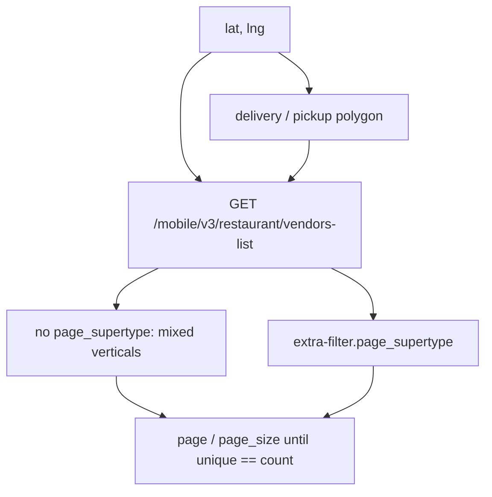

`superType=` **alone did not filter**. The working switch is:

```json
{ "page_supertype": [1] }
```

passed as `extra-filter`.

Sample at a **central Tehran** pin (September 2026):

| call | `count` | `open_count` |
|---|---|---|
| Food list, no `page_supertype` | ~930 | ~895 |
| `page_supertype=[1]` restaurants | ~582 | ~561 |
| `page_supertype=[2]` | ~137 | ~133 |
| another Tehran neighborhood, mixed | ~669 | ~632 |
| Market `vendors-list` at one address | ~17 | ~17 |

Closed Food kitchens stay on the list. Inactive / out-of-polygon never appear.

Market query `latitude`/`longitude` can be ignored if the PWA already bound `selectedAddress`.

---

## 6. Discounts: four ledgers, one coupon

UI names (تخفیف داغ, فودپارتی, شکار, فودپرو, کالاهای هدیه, نارنجی) are **not** one engine.

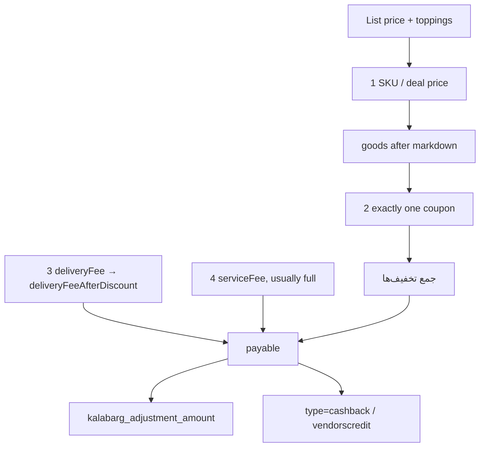

| # | ledger | lives on | coupon slot? |
|---|---|---|---|
| 1 | SKU / deal | `discount {amount,ratio}`; party id `-special` | no |
| 2 | **one coupon** | `vendor-rewards` `type=coupon` | **yes** |
| 3 | delivery quote | `deliveryFee` → `deliveryFeeAfterDiscount` | no |
| 4 | service fee | own line | almost never |
| after | کالابرگ | order `kalabarg_adjustment_amount` | no |
| after | جایزه خرید | `type=cashback` `{is_active}` | unconfirmed vs coupon |

Sheet copy: «در هر سفارش امکان انتخاب یک کوپن وجود دارد».

Auto-pick: `is_auto_selected` + `is_earned`. Ranking: `is_best_offer`. An earned `GEM` beats a `PRO` that is not yet earned (`minimum_basket_price`).

FoodPro plan **71** is not a fifth engine. It *issues* `type=PRO`, `vip_membership_plan=71`.

### `vendor-rewards` envelope

`GET apigw.snappfood.ir/menu-read-model/vendor-rewards/{vendorCode}`

```
{ data: [{ type, is_best_offer, coupon_data, discount_data, cashback_data, foodparty_data }], message }
```

| `type` | payload | coupon slot? |
|---|---|---|
| `coupon` | `coupon_data` | yes |
| `foodparty` | `{ title, discount }` | no |
| `discount` | `{ amount }` | no — menu % cap |
| `cashback` | `{ is_active }` | no |

### `coupon_data`

| field | notes |
|---|---|
| `id` | int |
| `title`, `descriptions` | |
| `type` | `PRO` \| `GEM` \| `CAMPAIGN` \| null |
| `reward` | `total_discount` \| `extra_item` \| `free_delivery_fee` |
| `coupon_type` / `condition` | see below |
| `condition_message` | |
| `minimum_basket_price` | string or null |
| `is_auto_selected`, `is_earned` | |
| `user_order_count` | |
| `activation_order_number` | e.g. `1` = first order at vendor |
| `vip_membership_plan` | `71` on Pro |
| `show_on_sticky_footer`, `show_in_carousel` | |
| `badge_section[]` | e.g. `{ name: "product_variation", data: { title } }` |

### `reward_packet`

```
{
  deliveryDiscount: { type: "percent", value, cashBack, maxDiscount } | null,
  basketDiscount:   { type: "percent", value, cashBack, maxDiscount } | null,
  extraProducts:    [{ productVariationId, title, price: 0, quantity, ID, Deleted }] | null,
  picture, message
}
```

`maxDiscount: -1` = uncapped (campaign free delivery). `cashBack: true` is the coupon-shaped cashback variant.

### `condition` / `coupon_type`

| value | meaning |
|---|---|
| `basket_price` | min goods |
| `days_passed_from_last_order_of_vendor` | Gem flash |
| `orders_of_vendor_count` | nth order at this vendor |
| `product_variation` | must add SKU X |

### Sample bill (party SKU + Pro on the remainder)

| line | toman |
|---|---|
| list | 525,000 |
| party 50% (`تخفیف محصولات`) | −262,500 |
| Pro 5% of leftover 262,500 | −13,125 |
| `جمع تخفیف‌ها` | 275,625 |
| delivery 68,000 → 23,000 (quote, not the coupon) | +23,000 |
| service | +7,500 |
| payable | 279,875 |

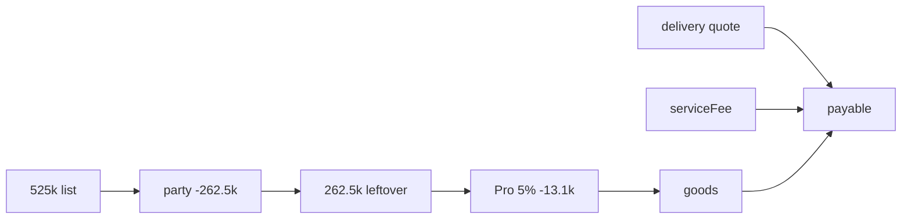

---

## 7. Named offers

### تخفیف داغ / off-box

UI `/off-box/`. Aggregator, not a type. Hero rails: menu %, cashback, free delivery, extra item, Food Party, FoodPro. Chips: تخفیف ویژه شما, پارتی, بالاترین تخفیف‌ها.

`GET /search/api/v1/user/off-box?filters={"filters":[…]}&superType=[0]`

Returns **vendors** `{ result[], total, super_types[], extra_sections }` with one `promotion_text` + `promotion_icon`. Party **tab** (`/off-box/?tab=party`) is SKU cards from food-party v4.

Vendor rollup card extras: `is_pro`, `is_jimbo`, `eta`, `delivery_fee`, `isDeliveryFeeHasDiscount`, `deliveryFeeAfterDiscount`.

| `filters[]` | UI | `promotion_text` example |
|---|---|---|
| `all` | همه | تا ۲۶٪ تخفیف منو |
| `has_discount` | تخفیف | تا ۲۶٪ تخفیف منو |
| `has_free_delivery` | ارسال رایگان | ارسال رایگان با N تومان خرید |
| `has_party` | پارتی | ۲۵٪ تخفیف پارتی |
| `has_extra_item` | محصول رایگان | محصول رایگان برای خرید اول |
| `has_cashback` | جایزه خرید | sparse |

`extra_sections.filters.sections[].data[]`: `{ title, value, subtitle, kind:"filters", icon, image, inactive_image, selected, single_choice }`

Party product URL:

`/product-details/party/{variationId}/?vendorId=&code=&dealProjectCode=&dealProjectListId=&dealProjectId=`

Basket deep link: `/basket/?code={vendor}&dealCode={dealProjectCode}`

### فودپارتی

`GET /search/api/v4/food-party?deal_project_list_id=61`

Envelope extras: `total_count`, `title` («پارتی با تخفیف داغ»), `firstActivePeriodStart(RFC)`, `firstActivePeriodEnd(RFC)`, `currentTimeRFC`, `activePeriodTitle` / `inactivePeriodTitle` (`تا پایان: {timer}`), `itemCountPerOrder`, `capacityPerOrder`, `productToppings`, `dealProjectListId`.

On a vendor menu the rail can be **renamed** (still `type=foodparty`).

SKU fields:

| field | notes |
|---|---|
| `productVariationId`, `vendorDailyDealId`, `stockScheduleId` | |
| `deal` via URL `dealProjectId` / `dealProjectCode` | |
| `weekday`, `allDay`, `discountWeekDays` | |
| `stockScheduleStartHour` / `StopHour` | sample ~11:00–17:00 |
| `discountStartHour1/2`, `discountStopHour1/2` | PHP-style `{date, timezone_type, timezone}` |
| `price`, `discount`, `discountRatio`, `priceAfterDiscount` | |
| `remaining`, `total_stock`, `showStock`, `stock` | |
| `capacityPerOrder`, `itemCountPerOrder`, `capacity` | usually 1 |
| `minOrder`, `deliveryFee`, `deliveryFeeAfterDiscount` | |
| `forNewUsers` | null here; Market uses `segment=new_user` |
| `proDiscountRatio` | e.g. 5 on the feed |
| `hasProDiscount`, `proDiscountAmount` | **false / 0 on the feed** |
| `proDeliveryFeeDiscount` | |
| `is_eco`, `is_ecommerce`, `isZFExpress` | |
| `vendorCode`, `vendorId`, `vendorTitle`, `superTypeAlias` | |
| `segmentId`, `superTypeId` | |

Line id in the basket: `{variationId}-special`.

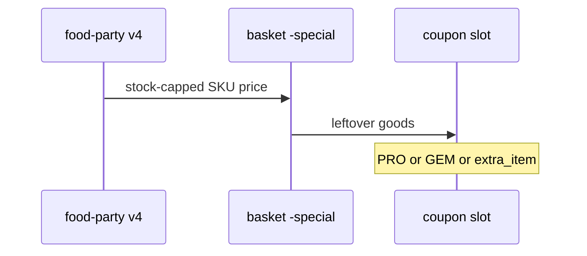

### تخفیف منو

Rewards `type=discount` `{ amount }`. Baked into ordinary SKU prices («تا ۲۶٪ تخفیف منو»). A kitchen can expose both `discount` and `foodparty`.

### شکار / Gem

`GET /search/api/v1/user/gem-vendor-list` → `{ result[], total, expire_date, current_date, super_types[] }`

UI `/gem/`. Vendor flags `is_gem`, badge `type=gem`, `event_hash=gem_…`. Cap copy «تا سقف 500,000 تومان». Observed percents 10–25.

Coupon: `type=GEM`, `condition=days_passed_from_last_order_of_vendor`, `reward=total_discount`, `basketDiscount.maxDiscount` ~500000. SKU stays `-normal`. **Replaces** Pro.

### فودپرو

`GET /membership/v1/active-subscription?plan_id=71`

`{ start_date, expire_date, source, accumulated_discount, order_count }`

Landing `/landing/foodpro/` = `GET /search/api/v7/home?landingTitle=foodpro` (bannerlist + `vendorcollection-*`, `filters=is_vip`). Also `/subscription/landing/`.

Home marketing (“20% + free delivery”) ≠ per-vendor coupon. Observed: 5% basket, or 0% titled ارسال رایگان. `condition=basket_price`, min often 200000.

Other VIP packages seen in `/mobile/v2/user/vip-packages`: plan `5` free-delivery pack, plan `8` steep-discount pack.

Market Pro = `packageType=DELIVERY_FEE` + cart coupon **2522**, conditions `basket_size` / `user_pro` / `vendor_pro` / `vendor_city` / `business_line`, min basket ~280000.

### Coupons at a glance

| `type` | `reward` | shape |
|---|---|---|
| `PRO` | `total_discount` | 0–5% and/or free-delivery title |
| `GEM` | `total_discount` | 10–25%, cap ~500k |
| `CAMPAIGN` | `free_delivery_fee` | 100% delivery, `maxDiscount=-1` |
| null | `extra_item` | `extraProducts[]` price 0 |
| null | `total_discount` | generic % at a high min |

`extra_item` **is** the coupon. Picking it drops Pro/Gem.

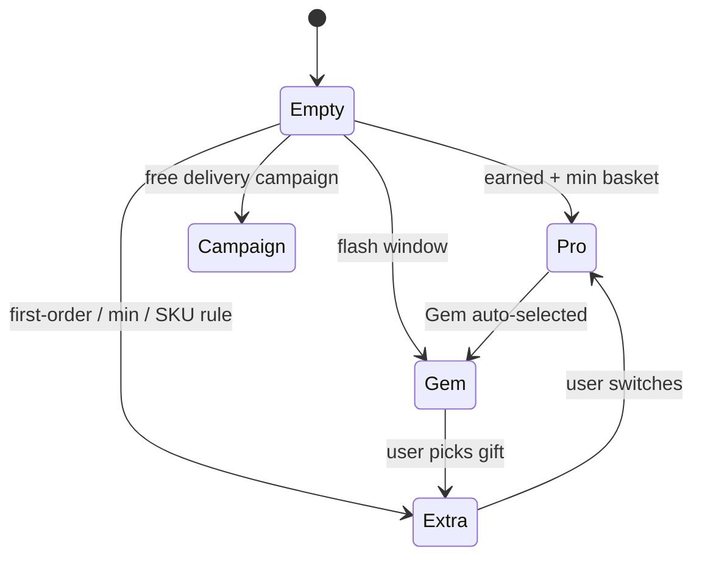

### سفارش یک‌نفره / اکو

`GET /search/api/v1/meal-for-one/product-list`

`{ count, title, description, finalResult[], superType }`

Rows `{ type: "PRODUCT", data }` where `data.type=PRODUCT_VARIATION`. Copy: cap ~299k + ارسال رایگان. `isEco` is a vendor badge; «اکوپلاس» is a product line. `is_jimbo` is a flag (ABT `backend_jimbo_on_card_eta_color`).

### کالابرگ / cashback

Kalabarg: not a coupon. Food grocery/protein tiles; Market badge `114` / `BEST_PRICE`. Settled as `kalabarg_adjustment_amount` on the order.

Cashback: off-box `has_cashback`; rewards `type=cashback`; `GET apigw…/cashback/api/client/v1/vendorscredit/{code}` → `{ wallet, cashGift }`; `/vendorscredit/count`.

---

## 8. Market Party

تخفیف نارنجی. Stock-capped hub markdown. **Does not** take the coupon slot.

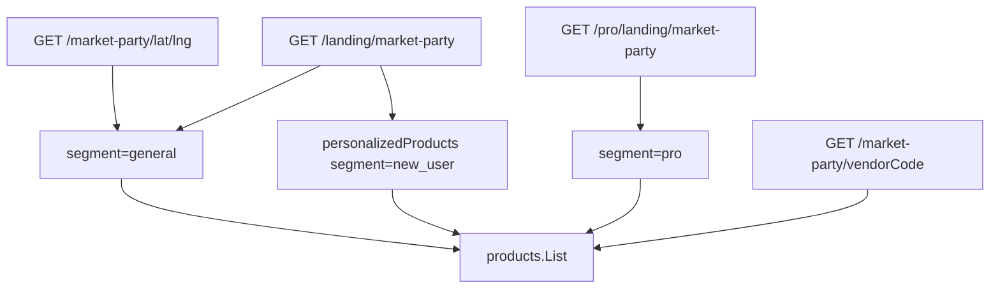

Query extras on the list: `deal_type=supermarket`, `is_user_pro`, `user_id`, `isPro`, `page`, `page_size`.

Envelope: `total_count`, `title`, `vendors[]` or `products` / `personalizedProducts`, period fields (same names as Food Party), `capacityPerOrder`, `config { coverImage, moreImage, mainImage, backgroundColor[], textColor }`.

Vendor rail extras: `vendor_id`, `vendor_name`, `vendor_code`, `delivery_fee`, `rating`, `comment_count`, `IsOpen`, `IsPro`, `ads`, `PreOrderEnabled`, `slowDeliveryDetail`.

SKU:

| field | notes |
|---|---|
| `productVariationId` | hub SKU |
| `price`, `discount`, `discountRatio` | |
| `discountId` | deal row |
| `stock`, `totalStock` | remaining vs campaign pool (~200) |
| `capacity` | 1 or 2 |
| `segment` | `general` \| `pro` \| `new_user` |
| `ads` | `ADS_TYPE_STATIC` \| `ADS_TYPE_NONE` |
| `minOrder`, `deliveryFee` | |
| `menu_category_id` / `title` | hub |
| `deliveryTypes` | |
| `badges[]` | کالابرگ can sit on a party SKU |
| `score`, `is_out_of_stock` | |

`products`: `{ PageSize, TotalCount, List[] }` on the vendor endpoint; landing uses `List` only.

| | Food Party | Market Party |
|---|---|---|
| UI | `/off-box/?tab=party` | `/marketparty-list` |
| Object | `-special` variation | hub offer + `discountId` |
| Window sampled | ~11:00–17:00 | ~24h |
| Cap | usually 1 | campaign 2; SKU 1–2 |
| Segments | `forNewUsers` unused | `general` / `pro` / `new_user` |
| Coupon slot | no | no |

New-user rail samples: 95–99% off.

---

## 9. Cart, checkout, orders

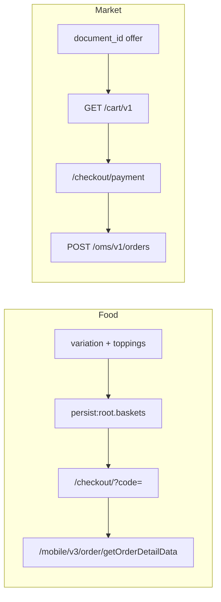

### Food basket (client)

Keyed by `vendorCode`. Party line id `{variationId}-special`. Persist also tracks `isFoodProSubscriptionAddedToBasket`. Min-basket rules: `GET /customer/order/v1/vendor/{code}/min-basket-rules`.

Checkout UI: delivery vs pickup, address OOR flags (`خارج از محدوده`), ASAP time, payment. Submit POST was **not** captured.

Food order UI states: accepted → prepared → on the way → delivered, then `/order/review/{orderCode}`. Other JS paths: `/mobile/v1/order/new`, `/reorder`, `/setCustomerDeliveredAt`, `/setDelayedOrder`, group-order `/mobile/v1/group-order/payment/new`.

### Market cart

`GET /cart/v1/carts`, `GET /cart/v1/{uuid}`, `GET /cart/v1/vendor/{code}`

Persist key seen: `persist:siteState.cart.offlineMultipleBasket`.

| field | notes |
|---|---|
| `id` | uuid |
| `vendor.id` / `code` / `mode` | e.g. `EXPRESS` |
| `prices.subtotal`, `service_fee`, `shipping_fee`, `gateway_pay_amount` | |
| `prices.*_share` | company / brand / vendor / commercial split |
| `shipping_methods[]` | `PICKUP` `ZF_EXPRESS` `DELIVERY` `SLOW` `TIME_SLOT` |
| `order_shipping_method` | selected |
| `banks[]` | saman, mellat, parsian, pasargad, `AP_Web`, `SNAPP_CREDIT` |
| `coupons[]` | e.g. 2522; conditions `basket_size/user_pro/vendor_pro/vendor_city/business_line` |
| `user_min_basket` | |
| `payable_flags` | hasProduct/Address/Bank/Source/Vendor/User/ShippingMethod/isMinOrderValueReached |
| `vendor_min_order` | `{ isMinOrderValueReached, minOrderValue, progress }` |
| `source` | e.g. `SUPERAPP_SUPERMARKET` |
| `products[]` | `id`, qty, price, `brand_id`, stock, badges |

Writes (do not call casually): `POST /cart/v1`, `PUT /cart/v1/{id}`, `PUT /cart/v1/{id}/voucher`, `DELETE /cart/v1/{id}`, `POST /oms/v1/orders` body `{ cart_id, device, udid, app_version, platform }`.

`error.code` 3003 / 3004 / 3008 / 3010 = token-refresh queue, **not** empty cart.

Checkout UI: `/modals/cart`, `/checkout/payment`. Shipping radios: سریع ~45m / توربو / زمان دیگر. Voucher `input[name=voucherCode]`, کالابرگ code, banks + SnappPay.

### Market OMS

`GET /oms/v1/orders/history?active=false`  
`GET /oms/v1/user/orders/{code}`  
`GET /oms/v1/delivery/courier/info/{code}`  
`GET /cs/pwa/orders/{code}/products`

| field | notes |
|---|---|
| `detail.code` | char(8) |
| `detail.cart_id` | uuid |
| `detail.created_at`, `vendor_accepted_at`, `delivery_delivered_at` | |
| `states.order` | e.g. `ORDER_COMPLETED` |
| `states.payment` | e.g. `PAYMENT_PAID` |
| `states.vendor` | e.g. `VENDOR_DISPATCHED` |
| `states.delivery` | e.g. `DELIVERY_DELIVERED` |
| `delivery.id` / `type` / `polygon_id` | e.g. `EXPRESS_DELIVERY_TYPE` |
| `address` | snapshot + `vendor_to_address_distance` |
| `order_products[].id` | bigint |
| `order_products[].product_id` / `barcode` / `sub_vendor_id` | |
| `device.device_type` / `platform` / `version` | e.g. `JEK_ANDROID` |
| `coupon.id` + `rewards[].share` | delivery discount split |
| `prices.product_price`, `service_fee`, `coupon_delivery_discount_amount`, `total_price` | |
| `eta[].eta_minutes` | |

### Belladonna vouchers

`GET /belladonna/api/v1/vouchers?filterType=all|usable&page&pageSize`

`{ code, title, expiryDate, status, rewardType, rewardMode, remainingUses, quantityPerUser }`

Seen: `status=used`, `rewardType=amount`, `rewardMode=cash`.

### Other Market user APIs

- `GET /user-experience/previous_purchase` — last SKUs, `documentId=product-vendor`
- `GET /user-experience/previous_purchase/vendor-base`
- `GET /user-experience/favorites/user` — `{ product_ids }`
- `GET /express-search/recommendations/checkout?vendor_code=`
- `GET /express-vendor/vendor-schedules/{code}` — `{ pro_discount_applied, data[] }`
- `GET /cs/pwa/banners` — `placement_key`: `AFTER_PURCHASE_SUCCESS` \| `AFTER_PURCHASE_FAILED` \| `ORDER_TRACKING`

`payment/v1/customer/providers/lazy` returned 400; use cart `banks[]`.

---

## 10. API map

Common Food query junk the PWA appends: `optionalClient`, `client`, `deviceType`, `appVersion`, `UDID`, `Bonyan=true`, `X_ABT=<growthbook json>`. Same `/mobile/*` on `superapp.snappfood.ir` was Arvan-403. Market `window.fetch` is wrapped; XHR still works.

### Food

```
GET  /mobile/v2/area/cities
GET  /mobile/v4/user/user-addresses?lat&long
POST /mobile/v1/user/credit/get
GET  /mobile/v2/user/vip-packages
GET  /mobile/v3/restaurant/vendors-list?lat&long&page&page_size&extra-filter
GET  /mobile/v2/restaurant/details/state?vendorCode
GET  /mobile/v2/restaurant/{code}/favorite
GET  /mobile/v1/restaurant/vendor-comment?vendorCode
GET  /mobile/v2/product-variation/search
GET  /mobile/v3/search
GET  /mobile/v3/search/suggest
GET  /mobile/v3/product-vendors/search
GET  /mobile/v1/order/userPendingOrders
GET  /mobile/v3/order/getOrderDetailData?orderCode
GET  /mobile/v1/order/review/info?orderCode
GET  /customer/order/v1/vendor/{code}/min-basket-rules

GET  apigw…/menu-read-model/{vendorCode}
GET  apigw…/menu-read-model/vendor-details/{vendorCode}
GET  apigw…/menu-read-model/vendor-review/{vendorCode}
GET  apigw…/menu-read-model/vendor-rewards/{vendorCode}
GET  apigw…/cashback/api/client/v1/vendorscredit/{vendorCode}
GET  apigw…/cashback/api/client/v1/vendorscredit/count

GET  /search/api/v1/user/off-box?filters
GET  /search/api/v4/food-party?deal_project_list_id
GET  /search/api/v1/user/gem-vendor-list
GET  /search/api/v7/home?landingTitle=foodpro
GET  /search/api/v1/meal-for-one/product-list
GET  /search/api/v1/user/recommendations
GET  /search/api/v1/banner
GET  /membership/v1/active-subscription?plan_id=71

GET  marketing-area.snappfood.ir/marketing/api/v1/marketing-area/get-by-location/{lat}/{long}
```

### Market

```
GET  /express-vendor/general/vendors-list?latitude&longitude
GET  /express-vendor/vendor-schedules/{code}
GET  /express-search/categories?latitude&longitude
GET  /express-search/product-list/vendor?latitude&longitude&vendor_code
GET  /express-search/recommendations/checkout?vendor_code=
GET  /cs/pwa/banners
GET  /cs/pwa/orders/{code}/products

GET  /adams/v1/users
GET  /adams/v1/users/addresses
GET  /mobile/v5/user/pro-info

GET  /cart/v1/carts
GET  /cart/v1/{cartId}
GET  /cart/v1/vendor/{vendorCode}

GET  /oms/v1/orders/history?active=false
GET  /oms/v1/user/orders/{code}
GET  /oms/v1/delivery/courier/info/{code}

GET  /belladonna/api/v1/vouchers?filterType=all|usable
GET  /user-experience/previous_purchase
GET  /user-experience/favorites/user

GET  /market-party/{lat}/{lng}?deal_type=supermarket&is_user_pro
GET  /market-party/{vendorCode}
GET  /landing/market-party/{lat}/{lng}
GET  /pro/landing/market-party/{lat}/{lng}
```

### Client persist keys (names only)

Food: `persist:root` (`baskets`, `baskets-api`), location (`activeCity`, `selectedAddressId`), `user_segments`.

Market: `persist:siteState`, `JWT` (do not export), `selectedAddress`.

### GrowthBook flags seen on Food `X_ABT`

`backend_delivery_fee_feature`, `backend_service_fee_feature`, `backend_sort_food_party`, `backend_party_nonfood_feature`, `backend_party_main_product_feature`, `backend_eco_food_feature`, `backend_pro_product_discount`, `backend_kalabarg_inquiry_feature`, `backend_free_delivery_coupon_m41_feature`, `backend_offbox_on_supertype_section`, `backend_jimbo_on_card_eta_color`, `backend_min_basket_rules_feature`, `backend_group_order`, `backend_m41_feature`, …

---

## 11. Cross-walk

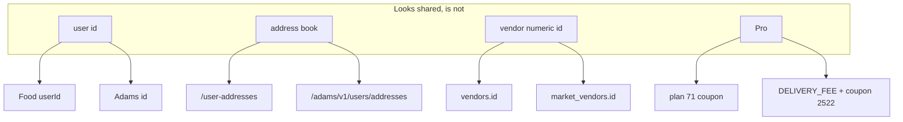

| concept | Food | Market |
|---|---|---|
| Public vendor id | `vendorCode` | `code` |
| SKU | `product_variations.id` | `products.id` + `document_id` |
| Menu category | per-vendor | hub `7312xx` |
| Party | `deal_projects` + `-special` | `discountId` + `segment` |
| Flash coupon | `GEM` | none seen |
| Extra SKU | `reward=extra_item` | none seen |
| Meal-for-one | `/meal-for-one/` | none seen |
| Aggregator | `/off-box/` | `/marketparty-list` |
| Delivery | quote on state API | `deliveryTypes` + fee |
| Kalabarg | order adjustment | badge 114 |
| Cart | persist baskets | UUID `/cart/v1` |
| Checkout | `/checkout/?code=` | `/checkout/payment` |
| Orders | `/mobile/v3/order/getOrderDetailData` | `/oms/v1/user/orders/{code}` |

---

## 12. What this is not

- Not affiliated with Snapp, SnappFood, or SnappMarket.
- Not a client, scraper, or exploit kit. Paths above are what the official PWAs already call.
- Not complete: checkout **submit** bodies were not captured; topping groups were empty on sampled pizzas; cashback vs coupon at payment is unconfirmed.
- Numbers (counts, percents, windows, plan ids) are snapshots from September 2026 and will rot.

If you work at Snapp and want something corrected, open an issue.
